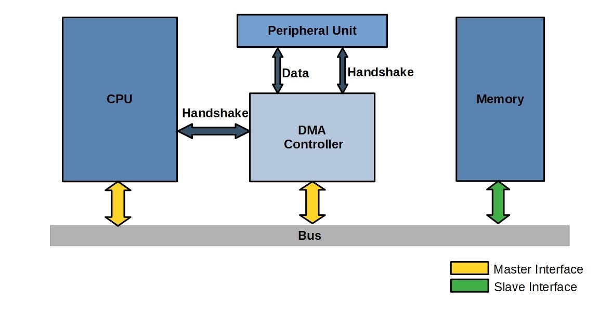

# 실제 개념
## DMA란
DMA(Direct Memory Access)란 주변장치에서 발생한 데이터를 CPU가 개입하지 않고도 DMA 컨트롤러가 메모리(RAM)로 직접 데이터를 전송하는 하드웨어 기능입니다. 

I/O 처리 방식은 다음과 같은 흐름으로 발전했습니다.
```
Polling -> Interrupt 기반 이벤트 처리 -> DMA + 완료 Interrupt
```
Interrupt 방식만 사용해도 이벤트 기반 실시간 반응은 가능하지만, 고속 데이터 환경에서는 인터럽트가 폭주하는 문제가 있습니다. 
예를 들어, UART 1 Mbps는 초당 100,000번의 ISR이 발생하여, CPU 부하가 급증할 것입니다.
이를 해결하기 위해 데이터 이동 작업을 전용 하드웨어로 전송하는 DMA 구조가 도입되었습니다.

DMA를 사용할 경우 흐름은 다음과 같습니다.
```
UART 수신 -> DMA가 RAM으로 자동 저장 -> 전송 완료 시, CPU에 완료 Interrupt 전달
```
이 구조에서 CPU는 데이터 복사 작업을 전혀 하지 않고, 제어와 후처리만 담당할 수 있게 됩니다. 
따라서 CPU 부하 감소, 처리량 감소, 전력 효율 개선 효과 등을 얻습니다.


## DMA 컨트롤러의 구성요소
DMA 컨트롤러는 주변장치 중 하나이며, 시스템 버스와 연결된 Bus Master입니다. 
DMA는 Bus Interconnect를 통해 버스의 사용 권한을 요청하고, 승인되면 메모리 접근을 수행합니다. 

### DMA 채널
DMA 채널은 독립적인 데이터 전송 작업 단위입니다.
```
Channel 0: ADC Result 전송
Channel 1: UART RX 수신 버퍼
Channel 2: SPI TX 송신 버퍼
```

각 채널은 하나의 전송 작업을 독립적으로 관리하며, 다음 설정 정보들을 갖습니다: `읽기 주소, 쓰기 주소, 전송 개수, 전송 크기, 주변장치 이벤트, 우선순위, 모드`

여러 채널은 동시에 요청 상태가 될 수 있지만, 실제 버스 전송은 한 번에 하나의 채널만 수행할 수 있습니다. 


### 채널 스케줄러
채널 스케줄러는 여러 DMA 채널의 전송 요청을 관리하고, 실행 순서를 결정합니다. 


여러 채널에서 동시에 전송 요청이 발생하면, 채널 우선순위를 비교하여 1개를 선택하고, 이 채널에 Bus Grant를 전달합니다. 
채널 우선순위는 개발자가 DMA 설정 시 레지스터를 통해 지정할 수 있으며, MCU에 따라 고정/순환/선점 방식이 선택될 수 있습니다. 


## DMA의 작동 흐름


(출처: https://velog.io/@prkty/Direct-Memory-Access-DMA)


CPU와 DMA 컨트롤러는 시스템 버스에 대해 Master Interface를 가지며, Bus Interconnect에 버스 사용 권한을 요청할 수 있습니다.
이를 통해 CPU와 DMA 컨트롤러 모두 메모리 공간에 직접 Read/Write 트랜잭션을 발생시킬 수 있는 주체입니다.

DMA 컨트롤러는 CPU와 설정 및 상태 제어를 위한 Handshake만 수행하고, 주변장치 유닛과는 DMA 요청/트리거 신호를 통해 전송 타이밍을 동기화합니다.
실제 데이터는 DMA가 Bus Master로서 시스템 버스를 통해 Peripheral 레지스터 주소에서 읽어와 메모리로 전송합니다.
