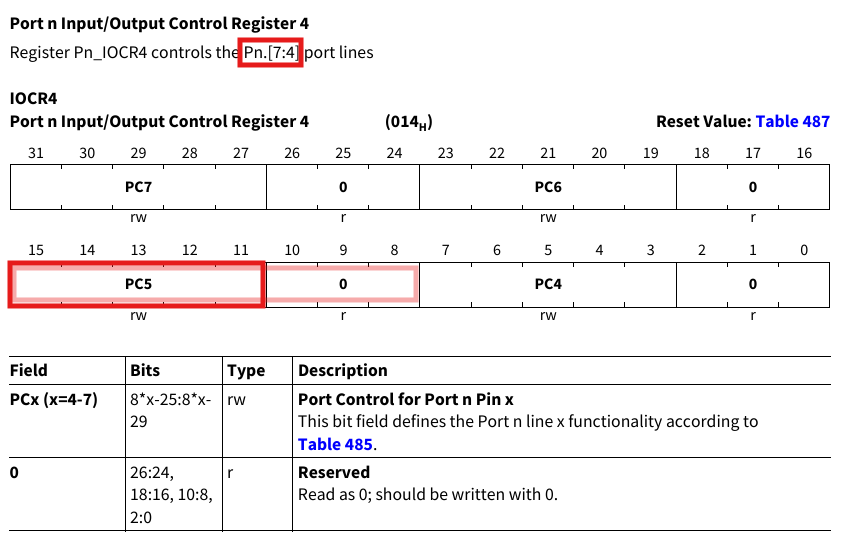
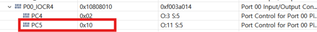

# Blinky_LED 예제 구조 정리

> 회로쪽 지식이 채워지면, 아래 H/W계층에서부터 위 계층까지 거꾸로 올라가는 방식으로 이해해봅니다!

Blinky LED 예제는 GPIO 출력기능을 이용해 특정 핀에 연결된 LED를 제어한는 가장 기본적인 임베디드 제어 예제입니다.
이 예제는 "Port 0, Pin 5, LED 연결"이라고 가정하고 해당 핀을 출력 모드로 초기화한 뒤에 일정 주기로 HIGH/LOW를 반복하여 LED를 깜빡이게 합니다.

메인 로직은 다음과 같이 단순한 구조를 가집니다.
```C
init_LED();

while (1)
{
    blink_LED();
}
```

## 1. LED 초기화 흐름
LED 제어는 다음 계층을 모두 거쳐 이루어집니다.
```
Application -> HAL (iLLD) -> Register -> Hardware
```

### 1) Application 계층
Application 계층에서는 iLLD API를 이용해 하드웨어를 제어합니다. 
덕분에 레지스터를 직접 다루지 않고 함수 인터페이스만으로도 제어가 가능합니다.
```C
void init_LED(void)
{
    IfxPort_setPinModeOutput(port, pinIndex, output_mode, output_index);
    IfxPort_setPinHigh(port, pin);
}
```

여기서 개발자가 해야할 일은 "어떤 포트 / 어떤 핀 / 어떤 모드"인지만 지정하는 것입니다.
LED를 초기화하는 목적만 표현할 뿐, 어느 레지스터에 비트를 건드는 것은 HAL 계층에 위임합니다.

개발자가 사용할 수 있는 API를 숙지하고 있으면 추후 목적과 의도에 맞게 잘 사용할 수 있습니다.
```C
// IfxPort.h 에 작성된 함수들 나열

// inline function
boolean IfxPort_getPinState(Ifx_P *port, uint8 pinIndex);
void IfxPort_setPinFunctionMode(Ifx_P *port, uint8 pinIndex, IfxPort_PinFunctionMode mode);
void IfxPort_setPinHigh(Ifx_P *port, uint8 pinIndex);
void IfxPort_setPinLow(Ifx_P *port, uint8 pinIndex);
void IfxPort_setPinModeInput(Ifx_P *port, uint8 pinIndex, IfxPort_InputMode mode);
void IfxPort_setPinModeOutput(Ifx_P *port, uint8 pinIndex, IfxPort_OutputMode mode, IfxPort_OutputIdx index);
void IfxPort_setPinState(Ifx_P *port, uint8 pinIndex, IfxPort_State action);
void IfxPort_togglePin(Ifx_P *port, uint8 pinIndex);

// global function
boolean IfxPort_disableEmergencyStop(Ifx_P *port, uint8 pinIndex);
boolean IfxPort_enableEmergencyStop(Ifx_P *port, uint8 pinIndex);
void IfxPort_setPinMode(Ifx_P *port, uint8 pinIndex, IfxPort_Mode mode);
void IfxPort_setPinModeLVDS(Ifx_P *port, uint8 pinIndex, IfxPort_Mode pinMode, IfxPort_LvdsConfig *lvds);
void IfxPort_setPinPadDriver(Ifx_P *port, uint8 pinIndex, IfxPort_PadDriver padDriver);
void IfxPort_setPinControllerSelection(Ifx_P *port, uint8 pinIndex);

// inline function 

// global function
Ifx_P *IfxPort_getAddress(IfxPort_Index port);
IfxPort_Index IfxPort_getIndex(Ifx_P *port);
void IfxPort_setGroupModeInput(Ifx_P *port, uint8 pinIndex, uint16 mask, IfxPort_InputMode mode);
void IfxPort_setGroupModeOutput(Ifx_P *port, uint8 pinIndex, uint16 mask, IfxPort_OutputMode mode, IfxPort_OutputIdx index);

```

### 2) HAL 계층 (iLLD)

HAL은 Application과 Register를 연결하는 계층으로, 내부 구현을 통해 레지스터에 어떻게 접근하는지 볼 수 있습니다. 
AURIX에서는 iLLD가 HAL 역할을 수행합니다. 

예를 들어, `IfxPort_setPinModeOutput()`함수를 Application 계층에서 호출하면, HAL에는 다음과 같이 구현되어있습니다.
```C
IFX_INLINE void IfxPort_setPinModeOutput(Ifx_P *port, uint8 pinIndex, IfxPort_OutputMode mode, IfxPort_OutputIdx index)
{
    IfxPort_setPinMode(port, pinIndex, (IfxPort_Mode)(index | mode));
}

void IfxPort_setPinMode(Ifx_P *port, uint8 pinIndex, IfxPort_Mode mode)
{
    // 1. 변수 추출 - iocr 선택
    volatile Ifx_P_IOCR0 *iocr      = &(port->IOCR0);
    uint8                 iocrIndex = (pinIndex / 4);
    uint8                 shift     = (pinIndex & 0x3U) * 8;

    // 2. 포트 40인 경우 특수 처리
    if (port == &MODULE_P40)
    {
        uint16 passwd = IfxScuWdt_getCpuWatchdogPassword();
        IfxScuWdt_clearCpuEndinit(passwd);
        port->PDISC.U &= ~(1 << pinIndex);
        IfxScuWdt_setCpuEndinit(passwd);
    }

    // 3. IOCR 레지스터 write - 8비트만 마스킹 + mode 저장을 원자적으로 수행
    __ldmst(&iocr[iocrIndex].U, (0xFFUL << shift), (mode << shift));
}
```
이 계층에서는 비트 위치를 계산하고, 레지스터 주소는 글로벌 변수로 숨깁니다. 
또한, 원자적 접근을 수행할 수 있으며, 보호 시퀀스를 처리합니다.
### 3) 레지스터 계층 
레지스터 계층에서는 실제 MCU 제어가 시작되는 곳으로, 직접 레지스터의 주소로 가서 레지스터 값을 씁니다. 

HAL 계층에서 계산된 값은 `IOCR 레지스터`, `OMR 레지스터`로 가서 기록됩니다. 


IOCR4 레지스터는 핀 4~7을 제어하므로, 핀5에 해당하는 PC5 자리의 5비트를 보면 됩니다. 


아래 3비트도 포함시키면 `1000 0000`이 되므로, 16진수로 보면 `0x80`이 됩니다.
이는 아래에 HAL 계층에 작성되어 있는 값과 동일합니다.
```C
typedef enum
{
    IfxPort_Mode_inputNoPullDevice      = 0,      /**< \brief Input, No pull device connected. */
    IfxPort_Mode_inputPullDown          = 8U,     /**< \brief Input, pull-down device connected. */
    IfxPort_Mode_inputPullUp            = 0x10U,  /**< \brief Input, pull-up device connected. */
    // HERE
    IfxPort_Mode_outputPushPullGeneral  = 0x80U,  /**< \brief Push-pull, General-purpose output */
    // ...
} IfxPort_Mode;
```

실제로 `init_LED()`까지 실행시켜서 디버깅을 해보면, 실제 IOCR4레지스터의 PC5자리는 `10000`값을 뜻하는 `0x10`이 저장된 것을 볼 수 있습니다. 



### 4) 하드웨어 계층
OCR 레지스터의 PC5 자리에 `10000`으로 변경되었다면, 내부 회로는 GPIO output 모드라는 것을 인지하고 Ouptut Driver를 활성화합니다. 
이는 추후 OUT 레지스터에 값이 변경되면, `0/1` 값을 핀에 전압으로 변환시켜 LED의 점등을 제어할 것입니다. 


## 2. LED 깜빡임 흐름
### 1) Application 계층 
아래 코드처럼 iLLD를 활용하여 레지스터를 몰라도 LED를 깜빡일 수 있습니다.
```C
void blinkLED(void)
{
    IfxPort_togglePin(PORT0, 5);
}
```
개발자는 어떤 포트인지, 어떤 핀인지만 고려하면 작동시킬 수 있습니다.

### 2) HAL 계층
HAL 계층은 아래처럼 구현이 되어 있습니다. 
```C
IFX_INLINE void IfxPort_togglePin(Ifx_P *port, uint8 pinIndex)
{
    IfxPort_setPinState(port, pinIndex, IfxPort_State_toggled);
}

IFX_INLINE void IfxPort_setPinState(Ifx_P *port, uint8 pinIndex, IfxPort_State action)
{
    // OMR 레지스터에 action을 저장
    port->OMR.U = action << pinIndex;
}
```
OMR 레지스터에 toggle/high/low/notChanged 등의 action을 저장하고 있는 것을 알 수 있습니다.


### 3) 레지스터 계층
레지스터는 PSx와 PCLx 비트에서 SET과 CLEAR의 조합으로 핀의 HIGH/LOW를 결정합니다.


아래 표처럼 핀을 토글시키기 위해서는 PCLx와 PSx 모두 1비트를 인가해야 합니다.


아래 HAL 코드를 보면 원하는 action을 해당 비트로 저장하는 것을 알 수 있고, toggle의 경우는 PS영역에 1, PCL영역에 1을 저장합니다.
```C
/** \brief Ifx_P output modification modes definition.
 *
 * \see Ifx_P.OMR, IfxPort_setPinState()
 */
typedef enum
{
    IfxPort_State_notChanged = (0 << 16) | (0 << 0),  /**< \brief Ifx_P pin is left unchanged. */
    IfxPort_State_high       = (0 << 16) | (1U << 0), /**< \brief Ifx_P pin is set to high. */
    IfxPort_State_low        = (1U << 16) | (0 << 0), /**< \brief Ifx_P pin is set to low. */
    // HERE!
    IfxPort_State_toggled    = (1U << 16) | (1U << 0) /**< \brief Ifx_P pin is toggled. */
} IfxPort_State;
```
따라서 `action << pinIndex` 로직은 바로 PS5, PCL5 비트의 위치인 21, 5비트 자리로 shift하는 의미인 것을 알 수 있습니다.

### 4) 하드웨어 계층
OMR 레지스터는 사실 LED를 제어하는데 직접적인 영향이 있지 않으며, 직접적인 영향이 있는 OUT 레지스터의 값을 변경하기 위한 제어 역할을 합니다.
OMR 레지스터가 쓰여지면 Output latch가 변경되고, 이는 OUT 레지스터에 결과가 반영되어 핀 전압의 변화에 직접 영향을 줍니다.

즉, OMR은 OUT 레지스터 값을 안전하게 변경하기 위한 write-only 제어 레지스터이며, 멀티코어 환경이나 인터럽트 환경에서도 OUT 레지스터를 직접 수정하지 않고 atomic하게 상태를 변경할 수 있도록 설계되었습니다.


## 3. 확장 제어 (멀티 LED)

